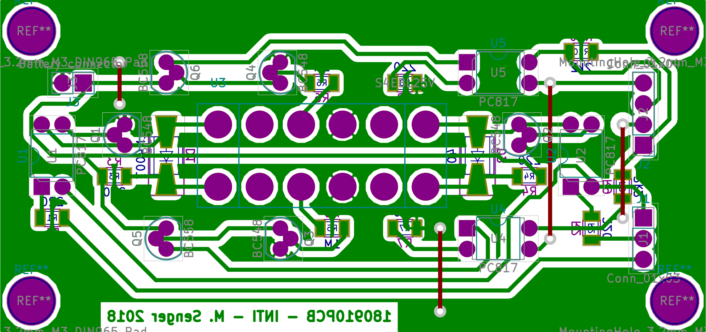

# voltage-scanner-pcb-180910pcb

[KiCad](http://kicad-pcb.org/) project for the 180919PCB board. This board handles the system for checking the line status. The schematic of this board can be found in [this link](export/180919PCB.pdf). Below is the layout.

